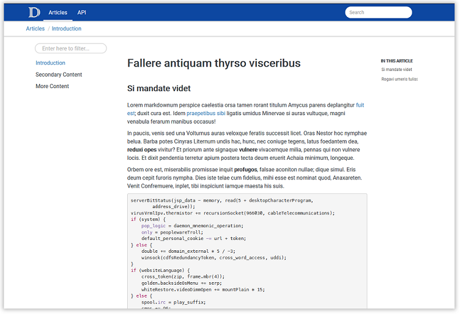

# DocFX Material

A simple material theme for [DocFX](https://dotnet.github.io/docfx/). This is an
override of the default template so you need to enable both in the `docfx.json`.



## Install

1. Download the source or the zipped file from the release.
2. Create a `templates` folder in the root of your DocFX directory.
3. Copy the `material` folder to the `templates` folder.
4. Update the `docfx.json` configuration to include the material template:
    ```json
    {
        "template": [
            "default",
            "templates/material"
        ],
    }
    ```