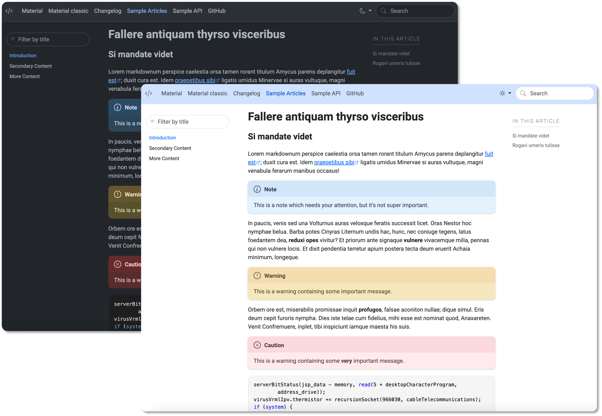

# DocFX Material

A simple material theme for [DocFX](https://dotnet.github.io/docfx/). This is an
override of the **modern** template so you need to enable both in the `docfx.json`.
The design was inspired by https://m3.material.io/.

If you are looking for the previous version of docfx-material that doesn't use the
modern template you can still get it as [material-classic](./docs/classic.md).



## Install

1. Download the source or the zipped file from the [releases](https://github.com/ovasquez/docfx-material/releases).
2. Create a `templates` folder in the root of your DocFX directory.
3. Copy the `material` folder to the `templates` folder.
4. Update the `docfx.json` configuration to include the material template:
```json
{
    "template": [
        "default",
        "modern",
        "templates/material"
    ],
}
```

## Color customization

DocFX's modern template is based on Bootstrap 5 (version 5.3 at the time of writing)
so you can use [Bootstrap's CSS variables](https://getbootstrap.com/docs/5.3/customize/css-variables/)
to customize a lot of the colors.

Here are some of the most common customizations that can be made in the template's
CSS file `material/public/main.css`, like updating the header color, changing the font,


```css
/* Changing the navbar color only for the light theme */
[data-bs-theme='light'] nav.navbar {
  background-color: var(--bs-primary-bg-subtle);
}

/* Change active navlink color */
.navbar-nav .nav-link.active,
.navbar-nav .nav-link.show {
  color: var(--bs-link-hover-color);
}

/* Changing the site font */
@import url('https://fonts.googleapis.com/css2?family=Roboto:wght@100;400;700&display=swap');

:root {
  ...
  --bs-font-sans-serif: 'Roboto';
  ...
}

```

## Markdown extras

For more reference about markdown support in DocFX check the
[official documentation.](https://dotnet.github.io/docfx/docs/markdown.html) 

> [!NOTE]
> This is a note which needs your attention, but it's not super important.
>
> [!WARNING]
> This is a warning containing some important message.
>
> [!CAUTION]
> This is a warning containing some **very** important message.

## DocFX tips

### Enable search

To enable search in DocFX it's not enough to set the configuration parameter to `true`:

```json
"globalMetadata": {
    "_enableSearch": "true"
}
```

You also have to indicate in the `docfx.json` the post processor that generates the index for the searches:

```json
"postProcessors": ["ExtractSearchIndex"],
```
