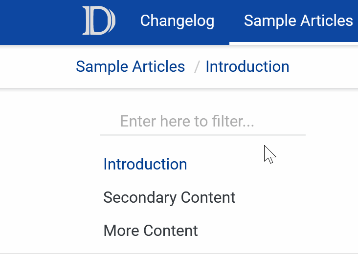

# Changelog

## Version 0.4.0 - May 19th 2020

- Usability improvements and minor style changes in textboxes.

 
 

## Version 0.3.1 - January 13th 2020

- Minor update in styles and shadows.

## Version 0.3.0 - December 2nd 2019

- Added easy customization of header and link colors.

## Version 0.2.0 - February 1st 2019

- Added material theme for the `note|warning|caution` blockquotes.
- Updated syntax highlight styles.

## Version 0.1.0 - January 31st 2019

- First release of the DocFX Material theme
