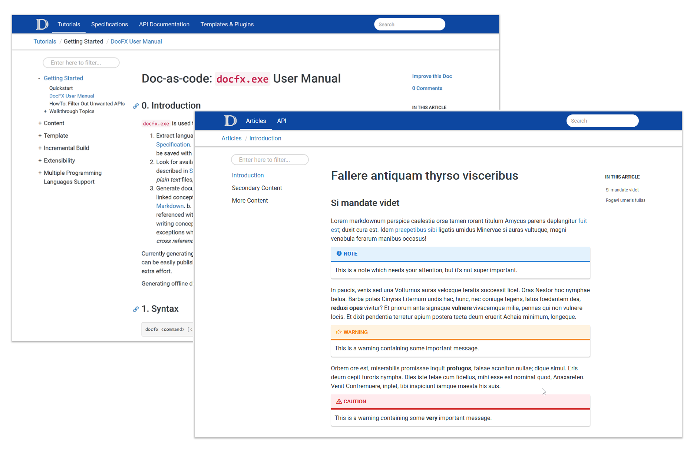

# DocFX Material

A simple material theme for [DocFX](https://dotnet.github.io/docfx/). This is an
override of the default template so you need to enable both in the `docfx.json`.

The colors were chosen using <https://material.io/tools/color>.



## Install

1. Download the source or the zipped file from the [releases](https://github.com/ovasquez/docfx-material/releases).
2. Create a `templates` folder in the root of your DocFX directory.
3. Copy the `material` folder to the `templates` folder.
4. Update the `docfx.json` configuration to include the material template:
    ```json
    {
        "template": [
            "default",
            "templates/material"
        ],
    }
    ```

## Color customization

You can easily customize the color of the header bar and the links by updating
the following variables in the `material/styles/main.css` file.

```css
:root {
  --primary-color: #1565c0; /* Header color */
  --primary-dark: #003c8f; /* Link color */
  --primary-light: #5e92f3; /* Link:hover color */
}
```

## Markdown extras

For more reference about markdown support in DocFX check the
[official documentation.](https://dotnet.github.io/docfx/spec/docfx_flavored_markdown.html?tabs=tabid-1%2Ctabid-a#note-warningtipimportant) 

> [!NOTE]
> This is a note which needs your attention, but it's not super important.
>
> [!WARNING]
> This is a warning containing some important message.
>
> [!CAUTION]
> This is a warning containing some **very** important message.
